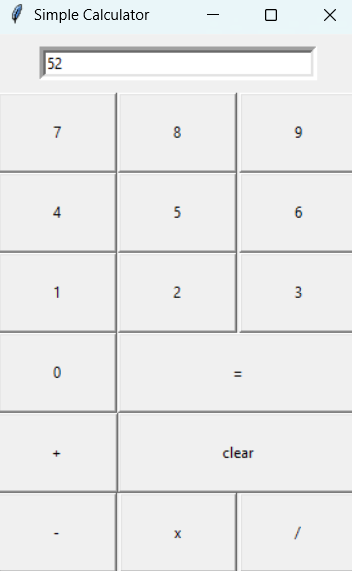

# 🧮 Simple Calculator (Python + Tkinter)

My first repository — a simple calculator written in Python using the Tkinter GUI library.  
This is a basic **GUI calculator application** built using **Python's Tkinter** library. It supports standard arithmetic operations such as addition, subtraction, multiplication, and division — all within a simple and intuitive interface.

 

**Author**: Kodati Sai Teja

---

## 🚀 Features

- 🖱️ Graphical User Interface using Tkinter  
- ➕ Basic arithmetic operations: `+`, `-`, `×`, `/`  
- 🧼 Clear button to reset input  
- 👇 Clickable number and operator buttons  
- 🧠 Handles division by zero with error display

---

## 🖼️ GUI Preview

Here's how the calculator looks when running:

> The UI is built with clean button placement using the grid layout manager in Tkinter.

---

## 🛠️ Technologies Used

- 🐍 Python 3
- 🎨 Tkinter (standard GUI toolkit for Python)

---

## 📂 File Structure

